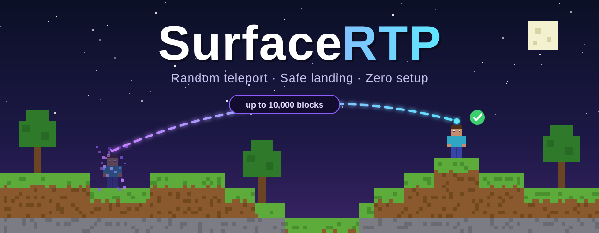

<div align="center">



### Random teleport that always lands players on solid ground.
Never underground. Never in the air. Never in water.

<br>

[](https://github.com/Jagm3nz/EasyRTP/releases/latest)


[](https://github.com/Jagm3nz/EasyRTP/releases/latest)
[](https://github.com/Jagm3nz/EasyRTP/releases)

</div>

---

## ✨ Features

|   |   |
|---|---|
| 🛡️ **Safe landing** | Players always land on the surface of solid land - never in caves, water, lava, trees or mid-air. |
| 📏 **Range from the player** | Picks a spot up to **10,000 blocks** on X and Z from where the player stands (fully configurable). |
| ⏱️ **Cooldown & warmup** | Countdown in the action bar, cancelled when the player moves or takes damage. |
| 🌍 **Multi-world** | Pick a world, disable worlds, redirect from disabled worlds, full Nether support. |
| 🔐 **Renamable permissions** | Every permission node can be renamed in the config to fit your server. |
| 🌐 **Translatable** | Every message lives in `config.yml` with `&` colors and HEX colors (`&#00FFAA`). |
| ⚡ **Lightweight** | Async chunk loading on Paper, one chunk per tick on Spigot - no lag spikes. |
| 📦 **One jar, all versions** | The same file works on every version from 1.18 to 1.21.11. No dependencies. |

## 📥 Installation

1. Download **`EasyRTP-<version>.jar`** from the [**latest release**](https://github.com/Jagm3nz/EasyRTP/releases/latest).
2. Put it into your server's `plugins` folder.
3. Restart the server.
4. *(Optional)* Adjust `plugins/EasyRTP/config.yml` and run `/rtp reload`.

That's it - `/rtp` works right away with sensible defaults.

## 🧩 Compatibility

| | Supported |
|---|---|
| **Minecraft** | 1.18 · 1.19 · 1.20 · 1.21 - including every sub-version up to **1.21.11** |
| **Server software** | Spigot, Paper, Purpur and other Spigot forks |
| **Java** | 17 or newer |
| **Dependencies** | None |

## ⌨️ Commands

| Command | Description | Permission |
|---|---|---|
| `/rtp` | Random teleport in your current world | `rtp.use` |
| `/rtp <world>` | Random teleport in the given world | `rtp.world` |
| `/rtp player <name> [world]` | Teleport another player - no cooldown or warmup, works from the console | `rtp.others` |
| `/rtp reload` | Reload the configuration | `rtp.reload` |

**Aliases:** `/wild`, `/randomtp`

## 🔐 Permissions

| Permission | Default | Description |
|---|---|---|
| `rtp.use` | everyone | Use `/rtp` |
| `rtp.world` | OP | Choose a world with `/rtp <world>` |
| `rtp.others` | OP | Teleport other players |
| `rtp.reload` | OP | Reload the configuration |
| `rtp.bypass.cooldown` | OP | No cooldown |
| `rtp.bypass.warmup` | OP | No countdown before teleporting |
| `rtp.*` | OP | All of the above |

> [!TIP]
> Every permission name can be changed in the `permissions` section of the config - e.g. `use: "myserver.rtp"`.
> Set it to `""` to allow everyone.

## 🛡️ How safe landing works

For every candidate location EasyRTP checks that:

- ✅ the block underfoot is **solid land** - not water, lava, magma, cactus, fire, logs, leaves, fences or walls
- ✅ there are **two free blocks** for the player's feet and head
- ✅ there is **only sky above** - the highest block in the column is used, so players never end up in caves
- ✅ the player stands **exactly on top** of the block (slabs included), so they never fall
- ✅ the biome is not on the blacklist (oceans and rivers by default)
- ✅ the location is **inside the world border**

In the **Nether** there is no surface, so players land in an open cave on solid ground below the bedrock roof.

## ⚙️ Configuration

The most important options:

| Option | Default | Description |
|---|---|---|
| `center` | `player` | Where the distance is measured from: `player`, `spawn` or `zero` (0, 0) |
| `max-x` / `max-z` | `10000` | Maximum distance in blocks on the X / Z axis (Y is not counted) |
| `min-distance` | `300` | Minimum distance, so players don't land right next to where they were |
| `cooldown` | `60` | Cooldown in seconds |
| `warmup` | `3` | Countdown before teleporting, in seconds |
| `disabled-worlds` | `world_the_end` | Worlds where `/rtp` does not work |
| `fallback-world` | `world` | Where players are sent when using `/rtp` in a disabled world |

<details>
<summary><b>📄 Full default <code>config.yml</code></b></summary>

```yaml
# ==========================================
#          EasyRTP - configuration
# ==========================================
# This file is created automatically on the first server start.
# After editing, run: /rtp reload (or restart the server)

# ------------------------------------------
#  RANGE
# ------------------------------------------
# Where the distance is measured from:
#   player - from the player's current position (default)
#   spawn  - from the world spawn
#   zero   - from coordinates 0, 0
# When using /rtp into a DIFFERENT world than the player is in, the target world's spawn is used.
center: player

# Maximum distance in blocks, separately for X and Z (Y is not counted).
# Example: player stands at X=100, Z=-200 with max-x and max-z = 10000
#   -> X is picked from -9900 to 10100 and Z from -10200 to 9800
max-x: 10000
max-z: 10000

# Minimum distance in blocks, so the player never lands right next to where they were.
# 0 = no minimum
min-distance: 300

# How many locations to check before giving up (1 attempt = 1 chunk)
max-attempts: 40

# ------------------------------------------
#  COOLDOWN & WARMUP
# ------------------------------------------
# Cooldown in seconds (0 = none)
cooldown: 60

# Countdown before teleporting, in seconds (0 = instant)
warmup: 3
# Whether moving / taking damage during the countdown cancels the teleport
cancel-on-move: true
cancel-on-damage: true

# ------------------------------------------
#  PERMISSIONS
# ------------------------------------------
# You can rename every permission, e.g. use: "myserver.command.rtp"
# Empty ("") = every player has this permission.
# "use" is granted to all players by default, the rest to OPs only.
permissions:
  use: rtp.use                          # /rtp
  world: rtp.world                      # /rtp <world>
  others: rtp.others                    # /rtp player <name> [world]
  reload: rtp.reload                    # /rtp reload
  bypass-cooldown: rtp.bypass.cooldown  # no cooldown
  bypass-warmup: rtp.bypass.warmup      # no countdown
  all: rtp.*                            # all of the above

# ------------------------------------------
#  WORLDS
# ------------------------------------------
# Worlds where /rtp does not work
disabled-worlds:
  - world_the_end

# When a player uses /rtp in a disabled world, they are sent to this world instead.
# Leave empty ("") to show an error instead.
fallback-world: world

# Highest Y to search in the Nether (the bedrock roof starts at Y=128).
# The Nether has no "surface", so players land in an open cave on solid ground.
nether-max-y: 120

# ------------------------------------------
#  SAFE LANDING
# ------------------------------------------
# The plugin always places the player ON the land surface:
#  - the highest solid block at that spot (only sky above, so never inside caves),
#  - standing on the block, never floating in the air,
#  - two free blocks for feet and head,
#  - never on water, lava, trees (logs and leaves), fences or walls.

# Biomes to avoid (names as shown in F3, e.g. ocean, river, deep_dark)
blacklisted-biomes:
  - ocean
  - deep_ocean
  - cold_ocean
  - deep_cold_ocean
  - frozen_ocean
  - deep_frozen_ocean
  - lukewarm_ocean
  - deep_lukewarm_ocean
  - warm_ocean
  - river
  - frozen_river

# Additional blocks the player must never land on or inside
unsafe-blocks:
  - LAVA
  - WATER
  - MAGMA_BLOCK
  - CACTUS
  - FIRE
  - SOUL_FIRE
  - CAMPFIRE
  - SOUL_CAMPFIRE
  - SWEET_BERRY_BUSH
  - POWDER_SNOW
  - POINTED_DRIPSTONE
  - WITHER_ROSE
  - BROWN_MUSHROOM_BLOCK
  - RED_MUSHROOM_BLOCK
  - MUSHROOM_STEM

# ------------------------------------------
#  EFFECTS
# ------------------------------------------
effects:
  # Sound after teleporting (name as in /playsound). Empty = none
  sound: entity.enderman.teleport
  # Particles after teleporting (e.g. PORTAL, CLOUD). Empty = none
  particle: PORTAL
  # Title on screen after teleporting
  title: true
  # Countdown above the hotbar during the warmup
  actionbar-countdown: true

# ------------------------------------------
#  MESSAGES
# ------------------------------------------
# Colors: &a, &l etc. and HEX: &#00FFAA. Empty message ("") = send nothing.
# Placeholders: {x} {y} {z} {world} {seconds} {time} {player}
messages:
  prefix: "&8[&bEasyRTP&8] &r"
  warmup: "&7Teleporting in &b{seconds}s&7. Don't move!"
  actionbar: "&7Teleporting in &b{seconds}s"
  searching: "&7Searching for a safe location..."
  success: "&aTeleported to &f{x}&7, &f{y}&7, &f{z} &a(&f{world}&a)"
  title: "&b&lRTP"
  subtitle: "&7{x}, {y}, {z}"
  failed: "&cCould not find a safe location. Please try again."
  cooldown: "&cYou must wait &f{time} &cbefore using this again."
  cancelled-move: "&cTeleport cancelled: you moved."
  cancelled-damage: "&cTeleport cancelled: you took damage."
  already-pending: "&cA teleport is already in progress, please wait."
  disabled-world: "&cRTP is disabled in world &f{world}&c."
  unknown-world: "&cThere is no world named &f{world}&c."
  unknown-player: "&cPlayer &f{player} &cis not online."
  teleporting-other: "&7Searching for a location for &f{player}&7..."
  success-other: "&aTeleported &f{player} &ato &f{x}&7, &f{y}&7, &f{z} &a(&f{world}&a)"
  no-permission: "&cYou don't have permission to use this command."
  player-only: "&cThis command can only be used by players. Use: /rtp player <name> [world]"
  reloaded: "&aConfiguration reloaded."
  usage: "&7Usage: &f/rtp &7[world] | &f/rtp player &7<name> [world] | &f/rtp reload"
```

</details>

## 🌐 Translating

Every message is in the `messages` section of `config.yml`. Change the texts to your language, run `/rtp reload` and you're done.
Plugin updates never overwrite your changes - new options are added automatically, existing ones stay untouched.

## ❓ FAQ

<details>
<summary><b>Does it work on Paper / Purpur?</b></summary>

Yes. On Paper and its forks EasyRTP loads chunks asynchronously, which makes it even smoother than on Spigot.
</details>

<details>
<summary><b>Can players land in the ocean?</b></summary>

No. Water is never accepted as ground, and ocean and river biomes are skipped by default (see `blacklisted-biomes`).
</details>

<details>
<summary><b>The first teleports take a moment - is that normal?</b></summary>

Yes - far-away chunks may have to be generated first. Pre-generating your world (for example with the Chunky plugin) makes teleports instant.
</details>

<details>
<summary><b>How do I disable RTP in the End?</b></summary>

It is disabled by default - see `disabled-worlds`. Players using `/rtp` there are sent to `fallback-world`.
</details>

<details>
<summary><b>Another plugin also uses <code>/rtp</code>.</b></summary>

Use `/easyrtp:rtp`, or disable the other plugin's command. EasyRTP also registers `/wild` and `/randomtp`.
</details>

## 🐞 Support

Found a bug or have an idea? [Open an issue](https://github.com/Jagm3nz/EasyRTP/issues) - please include your server version (`/version`) and any errors from the console.

## 📜 License

EasyRTP is **free to use** on any server, including commercial ones. Redistribution and re-uploading are not allowed - see [LICENSE](LICENSE.md).

<div align="center">
<br>
<sub>Made with 💜 by <a href="https://github.com/Jagm3nz">Jagm3nz</a></sub>
</div>
